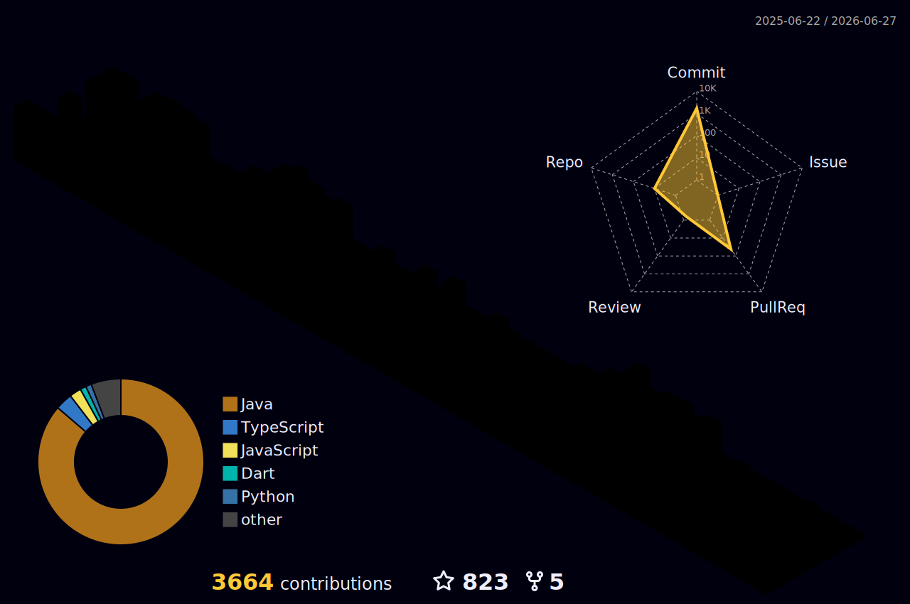

 

<p align="center">
  <a href="https://github.com/ArjiJethin">
    
  </a>
  
</p>

---

###  &nbsp; About Me

```bash
eswar@github:~$ neofetch

             /\              User:      Eswar Arji
            /  \             Role:      AI/ML Developer
           / /\ \            Location:  Bengaluru, India 🇮🇳
          / ____ \           Education: CSE @ Dayananda Sagar University
         /_/    \_\          
                              
                             Skills:     React | Java | Python | JavaScript
                             Focus:      DevOps | Cybersecurity | UI/UX
                             Learning:   Flutter | MLOPS
                             Fun Fact:   Me Funny AF 🤪
                             Email:      arjijethin.ac0705@gmail.com
```

<div align="center">
  
  &nbsp;&nbsp;&nbsp;  
</div>


##  Tech Stack

<table width="100%" cellpadding="14">

<tr>

<td width="50%" valign="top">

### 🤖 AI Stack

<pre>
Core:
  - Python
  - FastAPI
  - Scikit-Learn

AI / ML:
  - PyTorch
  - TensorFlow

AI Systems:
  - RAG
  - FAISS
</pre>


</td>

<td width="50%" valign="top">

### 💻 Development

<pre>
Languages:
  - JavaScript
  - TypeScript
  - Java

Frameworks:
  - React
  - Next.js
  - Flutter
</pre>


</td>

</tr>

<tr>
<td colspan="2" height="20"></td>
</tr>

<tr>

<td width="50%" valign="top">

### 🛠 Tools & Platforms

<pre>
Version Control:
  - Git
  - GitHub

Development:
  - VS Code
  - Docker
  - Postman

Cloud:
  - Vercel
  - AWS
</pre>


</td>

<td width="50%" valign="top">

### 🧠 Domains & Skills

<pre>
Programming:
  - Java
  - Python
  - C

Core Areas:
  - App & Full Stack Development
  - AI / ML
  - Cloud Computing

Other Skills:
  - UI / UX Design
  - Problem Solving
</pre>


</td>

</tr>

</table>


###  &nbsp; GitHub Stats

<div align="center">


<br>


<br>

<a href="https://app.daily.dev/eswararji">

</a>

<br>

</div>

<br>

<div align="center">

</div>

<br>


###  &nbsp; Let's Connect

<div align="center">

<a href="https://www.linkedin.com/in/arji-jethin-naga-sai-eswar-345138278/">

</a>
&nbsp;&nbsp;&nbsp;&nbsp;

<a href="https://mail.google.com/mail/?view=cm&to=arjijethin.ac2207@gmail.com&su=Connecting%20with%20Eswar%20Arji&body=Hello%20Eswar%2C%0A%0AI%20came%20across%20your%20GitHub%20profile%20and%20would%20like%20to%20connect%20regarding%20________________.%0A%0ALooking%20forward%20to%20hearing%20from%20you.%0A%0ABest%20regards%2C%0A">

</a>
&nbsp;&nbsp;&nbsp;&nbsp;

<a href="https://leetcode.com/u/EswarArji/">

</a>
&nbsp;&nbsp;&nbsp;&nbsp;

<a href="https://www.instagram.com/eswararji07/">

</a>
&nbsp;&nbsp;&nbsp;&nbsp;

<a href="https://www.youtube.com/@ARJIJETHIN">

</a>

</div>

<h1 align="left"></h1>


<a href="https://shattereddisk.github.io/rickroll/rickroll.mp4" target="_blank" title="hehe :)" rel="noopener noreferrer">

</a>

[comment]: <> (https://avatars.githubusercontent.com/u/180202573?v=3)
[comment]: <> (Git-UserID: 180202573)
[comment]: <> (--- made by Arji Jethin Naga Sai Eswar)

