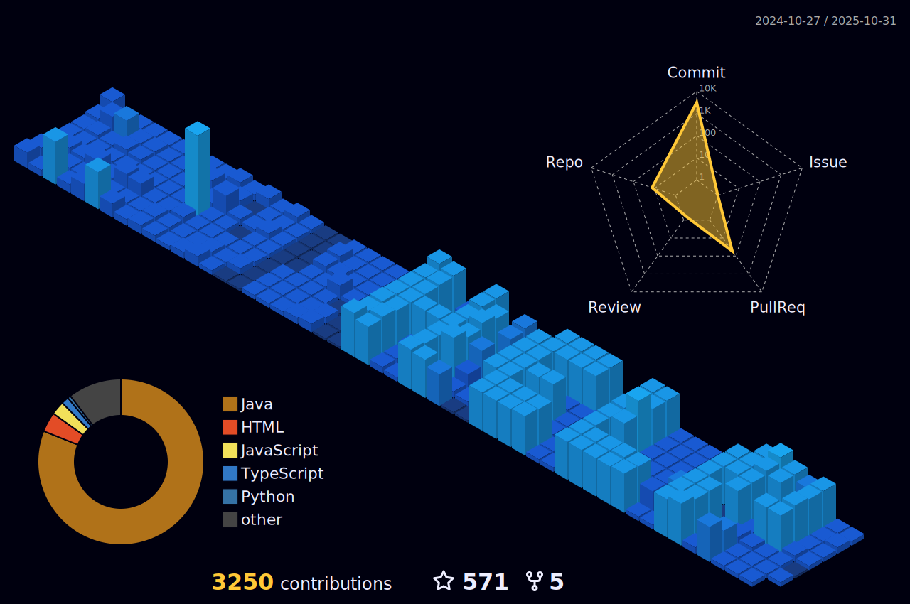

    

‎ 
     

      

<h3 align="center">A Coding Enthusiast💻, currently a University Student🎓</h3> 
<h3 align="left">    
      
    ‎  About Me:
  </h3>    

###

    ➤
        
      I’m currently a 2nd Year student at Dayananda Sagar University  ➤
      
      Interested in Full Stack, Cyber, UI/UX, Networking ➤
      
      I’m currently learning React, JavaScript, Java, Express  ➤
      
      Fun fact, I think I am Funny :)  
      ➤
      
      How to reach me: 
      <a href="mailto:arjijethin.ac0705@gmail.com" target="_blank">
        arjijethin.ac2207@gmail.com
      </a>
    </b>
  

  
  
  

<h2 align="left"> ‎ Socials:</h2>

###

  
  
  
  
      
  
  
  
  
  
    
  

 

###

<h2 align="left"> ‎ Tech Stack:</h2>

###

  

  
  
  
  
  
  
  
  
  
  
  
  
  
  
  
  
  
  
  
  
  
  
  
  
  
  
  
  
  
  
  
  
  
  
  
  
  
  
  
  
  
  
  
  

###

<h2 align="left">‎ ‎ GitHub Stats:</h2>

###

  
  

  

###

<h2>
 ‎ GitHub Trophies</h3>
    

<h2>
    
 ‎ Top Contributed Repo</h2>
  
  
  
      
   

 

<h1 align="left"></h1>

 
 

[comment]: <> (https://avatars.githubusercontent.com/u/180202573?v=3)
[comment]: <> (Git-UserID: 180202573)
[comment]: <> (--- made by Arji Jethin Naga Sai Eswar)
